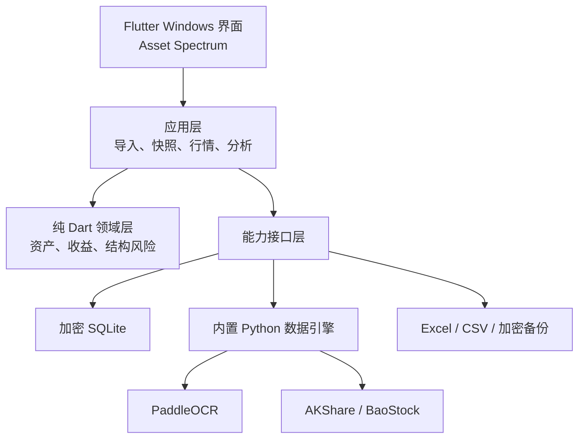

# FundLens Windows 版产品与技术设计规格

- 状态：已完成方案评审，等待用户审阅书面规格
- 日期：2026-07-19
- 产品阶段：Windows V1
- 视觉方向：Asset Spectrum / 资产光谱

## 1. 产品定义

FundLens 是一款面向个人投资者的本地资产快照分析软件。它将来自支付宝、同花顺和手动录入的持仓统一汇总，在 Windows 桌面端展示总资产、资产结构、当前浮动盈亏、历史快照变化和客观的结构风险信息。

FundLens 的基本原则是：先统计，再分析；只描述资产事实，不代替用户作出投资决策。

### 1.1 V1 目标

用户完成一次持仓导入后，应能在约 30 秒内看清：

1. 当前总资产、持有成本和浮动盈亏；
2. 不同资产类别、产品类型和来源平台的金额及占比；
3. 主要持仓、最大单品占比和最大类别占比；
4. 行情日期、收益统计覆盖率和数据质量状态；
5. 当前组合与某个历史快照之间的资产金额和结构变化。

### 1.2 明确不做

Windows V1 不包含：

- Android 客户端或 APK；
- 云端账户、云同步或多用户系统；
- 自动登录支付宝、同花顺或券商账户；
- 自动交易；
- 买入、卖出、加仓、减仓、调仓或再平衡建议；
- 交易流水、申购赎回流水或精确资金流跟踪；
- 将快照差额直接解释为投资收益；
- VaR、最大回撤、波动率、夏普率等量化风险指标；
- 实时分时行情和分时图。

Android 仅作为未来可能的扩展方向。V1 不为 Android 编写页面、平台适配或构建配置，但领域模型和能力接口不得依赖 Windows UI。

## 2. 资产范围

V1 支持以下持仓：

- 现金与现金管理：现金、余额宝、货币基金等；
- 银行存款：活期、定期和大额存单等；
- 场内股票；
- 场内基金：ETF、LOF 和公募 REITs 等；
- 场外基金：ETF 联接基金、指数基金、主动基金、混合基金、债券基金、FOF 和 QDII 等；
- 黄金与贵金属：黄金 ETF、黄金基金、积存金、纸黄金和手工估值的实物黄金。

V1 不单独支持直接持有的国债、公司债、地方债和可转债。债券类暴露仅通过债券基金纳入。

### 2.1 双轴分类

为避免“ETF”和“黄金”“债券”处于不同分类层级，持仓采用两个正交维度：

| 维度 | 示例 |
|---|---|
| `instrument_type` 产品形态 | 现金管理、银行存款、股票、ETF、LOF、REIT、场外基金、积存金、实物黄金 |
| `asset_class` 经济资产类别 | 现金、存款、权益、固定收益、混合、黄金、其他 |

例如：

- 黄金 ETF：`instrument_type = ETF`，`asset_class = 黄金`；
- 纯债基金：`instrument_type = 场外基金`，`asset_class = 固定收益`；
- ETF 联接基金：`instrument_type = 场外基金`，经济资产类别按其跟踪标的确定。

## 3. 平台与技术路线

### 3.1 平台范围

V1 只开发、测试和交付 Windows 桌面应用。最低支持的窗口尺寸为 `1280 × 720`，重点验证 `1440 × 900` 和 `1920 × 1080`，并支持 Windows 高 DPI 缩放。

### 3.2 技术栈

- UI 与应用编排：Flutter + Dart；
- 核心计算：纯 Dart；
- 本地数据库：SQLCipher 兼容的加密 SQLite；
- Windows 数据引擎：随安装包交付的 Python 子进程；
- 本地 OCR：PaddleOCR 中文模型，由 Python 数据引擎调用；
- 免费行情：BaoStock 与 AKShare，通过可替换的 Python 适配器调用；
- Windows 密钥保护：Windows Credential Manager 或等价的系统凭据存储；
- 安装交付：Windows 安装程序，内含 Flutter 运行时、Python 引擎和 OCR 模型。

Python 引擎使用 PyInstaller 的 one-directory 方式随应用安装，避免依赖用户机器上的 Python 环境；Flutter 只启动安装目录内经过版本校验的引擎入口。

具体依赖版本在实施开始时选择当时的稳定版本，并通过 Flutter lockfile、Python 约束文件和构建清单固定；升级必须经过完整回归测试。

## 4. 系统架构



### 4.1 界面层

负责 Windows 页面、Asset Spectrum 视觉组件、持仓表格、图表、表单和用户反馈。界面层不得直接计算金融指标，也不得直接访问 Python 包或数据库表。

### 4.2 应用层

负责组织完整用例：导入、校验、确认、更新当前持仓、保存快照、刷新行情、创建备份和恢复备份。所有写操作均通过明确的事务边界执行。

### 4.3 领域层

使用纯 Dart 实现资产分类、估值、成本、浮动盈亏、收益覆盖率、集中度和快照差异。领域层不依赖 Flutter、数据库、OCR 或网络，能够独立测试。

### 4.4 Python 数据引擎

Python 只负责：

- 本地中文 OCR；
- 产品名称与代码候选匹配；
- 股票、ETF 和场外基金行情获取；
- 将外部字段转换为版本化的统一数据传输对象。

Python 不负责总资产计算、风险分析、正式持仓写入、快照管理和备份加密。

Flutter 以受控子进程启动数据引擎，通过标准输入/输出上的逐行 JSON-RPC 2.0 消息通信，不开放本地 HTTP 端口。每个请求和响应都携带 `schema_version = 1`；协议版本不兼容时拒绝调用并提示更新。数据引擎异常退出时，Flutter 进入可降级状态，继续使用手工数据和缓存行情。

## 5. 视觉设计

视觉概念为 **Asset Spectrum / 资产光谱**。设计对象是需要在同一界面中审视股票、基金、存款、现金管理和黄金的个人投资者；首页唯一任务是在约 30 秒内说明当前组合的规模、结构、盈亏和数据状态。

视觉设计板见：[FundLens Asset Spectrum 设计板](assets/fundlens-asset-spectrum-design.svg)。

### 5.1 设计特征

- 使用资产光谱替代首页普通饼图；
- 点击光谱分段后，同步过滤持仓和结构观察；
- 少圆角、弱阴影、细分隔线，避免堆叠通用卡片；
- 标题、正文和金融数字使用不同字体角色；
- 金额采用等宽数字并按小数点对齐；
- 国内颜色习惯：红色表示盈利，绿色表示亏损；
- 关键信息不依赖鼠标悬停；
- 支持键盘焦点、系统缩放和减少动态效果。

### 5.2 设计令牌

| 名称 | 值 | 用途 |
|---|---|---|
| Graphite | `#121817` | 导航、主文字、焦点边界 |
| Frost | `#F2F5F3` | 应用背景 |
| Paper | `#FFFFFF` | 数据表面 |
| Lens Indigo | `#625BD4` | 品牌强调和聚焦状态 |
| Profit Vermilion | `#C54B40` | 盈利 |
| Loss Jade | `#2E8162` | 亏损 |

字体角色：

- 标题与快照日期：思源宋体或 Noto Serif CJK SC；
- 界面与正文：思源黑体或 Noto Sans CJK SC；
- 金额和比例：IBM Plex Mono，启用等宽数字。

### 5.3 动效

只保留一个有意义的编排动效：导入或切换快照后，资产光谱在 300–450 ms 内从整体状态聚焦到当前选择。其余反馈使用轻量状态变化；系统开启减少动态效果时禁用非必要动画。

## 6. 页面结构

Windows 左侧固定导航包含 6 个页面：

| 页面 | 核心职责 |
|---|---|
| 资产总览 | 总资产、成本、浮动盈亏、资产光谱、结构观察、主要持仓和行情状态 |
| 资产分析 | 按资产类别、产品形态和来源平台分析金额、占比、盈亏及集中度 |
| 全部持仓 | 搜索、筛选、排序、新增、编辑、删除和手动刷新行情 |
| 历史快照 | 对比两个日期的总资产、持仓金额和资产结构变化 |
| 导入与识别 | Excel/CSV、截图 OCR、字段预览、数据问题处理和确认写入 |
| 设置与备份 | 分类规则、结构提示阈值、行情设置、加密备份、恢复和隐私设置 |

“数据问题”不单独设置导航页面。应用其他页面发现问题时，在顶部显示状态入口；点击后跳转到“导入与识别”的问题处理区域。

## 7. 数据模型

### 7.1 当前持仓 `holding`

| 字段 | 含义 |
|---|---|
| `id` | 本地唯一标识 |
| `source_platform` | 支付宝、同花顺或手动 |
| `instrument_type` | 产品形态 |
| `asset_class` | 经济资产类别 |
| `product_name` | 产品名称 |
| `product_code` | 产品代码，可为空 |
| `currency` | 币种，V1 默认 CNY |
| `quantity` | 持有数量或份额，可为空 |
| `available_quantity` | 可用数量，可为空 |
| `current_price` | 当前价格或净值，可为空 |
| `cost_price` | 成本价，可为空 |
| `current_value` | 当前金额或市值，必填 |
| `cost_amount` | 持有成本，可为空 |
| `holding_profit` | 当前持有收益，可为空 |
| `holding_return` | 当前持有收益率，可为空 |
| `daily_profit` | 平台显示日收益，可为空 |
| `cumulative_profit` | 平台累计收益，可为空，不进入当前浮动盈亏汇总 |
| `platform_tags` | 稳健理财、定投、固收+等原始标签列表 |
| `valuation_method` | 自动行情、数量乘价格或手动金额 |
| `valuation_date` | 价格或净值日期 |
| `data_origin` | 手动、Excel、CSV 或 OCR |
| `field_provenance` | 每个关键字段的原始、推算、行情或用户修正来源 |
| `note` | 用户备注 |
| `created_at` / `updated_at` | 本地审计时间 |

### 7.2 历史快照

历史快照由 `snapshot` 和 `snapshot_holding` 组成。快照保存时冻结以下信息：产品名称、平台、分类、数量、价格、市值、成本、盈亏、行情日期和字段来源。后续行情更新不得修改历史快照。

### 7.3 其他数据对象

- `import_batch`：一次文件或截图导入任务；
- `draft_holding`：确认前的临时持仓；
- `data_issue`：字段、严重程度、问题代码、说明和解决状态；
- `quote_cache`：产品代码、价格或净值、行情日期、获取时间、数据源和新鲜度；
- `classification_rule`：名称、代码或平台标签到标准分类的映射；
- `app_setting`：行情、提示阈值、隐私和界面设置；
- `backup_metadata`：备份版本、创建时间、校验值和数据结构版本。

## 8. 支付宝与同花顺字段映射

用户提供的真实界面仅作为规划参考。原始截图不进入代码仓库，自动化测试使用脱敏合成图。

### 8.1 支付宝

| 平台字段 | FundLens 字段或处理方式 |
|---|---|
| 产品名称 | `product_name` |
| 基金、稳健理财、进阶理财、定投、固收+等 | 原样保存到 `platform_tags`，不直接作为资产类别 |
| 金额 | `current_value` |
| 占比 | 保存原始值用于校验，组合占比由 FundLens 重算 |
| 日收益 | `daily_profit` |
| 持有收益 | `holding_profit` |
| 持有收益率 | `holding_return` |
| 累计收益 | `cumulative_profit`，独立展示，不加入当前浮动盈亏 |

支付宝通常不在持仓列表中显示产品代码、份额和成本价。系统使用产品名称查找代码候选，用户确认后保存。

### 8.2 同花顺

| 平台字段 | FundLens 字段 |
|---|---|
| 名称 | `product_name` |
| 市值 | `current_value` |
| 盈亏金额 | `holding_profit` |
| 盈亏率 | `holding_return` |
| 持仓数量 | `quantity` |
| 可用数量 | `available_quantity` |
| 成本价 | `cost_price` |
| 现价 | `current_price` |

分时图、成交额、换手率、账号信息和底部导航不进入持仓模型。正负号必须通过字符识别确认，不能仅通过颜色推断。

## 9. 计算口径

### 9.1 支付宝持仓

```text
当前金额 = 平台显示金额
持有收益 = 平台显示持有收益
推算成本 = 当前金额 − 持有收益
```

平台显示收益率与推算收益率同时存在时进行一致性校验。累计收益保持独立。

### 9.2 同花顺持仓

```text
当前金额 = 市值
持有收益 = 平台显示盈亏金额
推算成本 = 当前金额 − 持有收益
参考成本 = 成本价 × 持仓数量
```

推算成本与参考成本的差异超过金额和比例容差时生成数据问题，由用户确认采用哪一个值。

### 9.3 通用规则

```text
浮动盈亏 = 当前金额 − 持有成本
持有收益率 = 浮动盈亏 ÷ 持有成本
总收益率 = 有成本资产的浮动盈亏之和 ÷ 有成本资产的成本之和
收益统计覆盖率 = 有成本资产当前金额之和 ÷ 总资产
```

- 成本为空或等于零时不计算收益率；
- 每项持仓占比和每类资产占比均由 FundLens 基于统一组合重新计算；
- 快照间差额称为“资产金额变化”，不称为投资收益；
- 平台原始值、推算值和用户修正值必须保留来源标识。

## 10. 当前持仓与快照流程

当前持仓可通过导入、OCR、手动编辑和行情刷新持续更新。历史快照不可变。

流程规则：

1. 导入支付宝或同花顺数据并确认后，更新当前持仓；
2. 用户点击“保存当前快照”时生成历史快照；
3. 自动行情刷新不自动生成快照；
4. 历史快照不能直接编辑，只能删除后重新创建；
5. 删除快照、覆盖平台数据和恢复备份必须二次确认。

## 11. 导入与 OCR

### 11.1 四步流程

1. 选择 Excel、CSV、支付宝截图或同花顺截图；
2. Python 数据引擎解析并产生字段级置信度；
3. 在同一页面处理缺失字段、重复项、异常金额和低置信度字段；
4. 用户确认后，以单个数据库事务写入当前持仓。

### 11.2 截图导入

- 支持一次选择多张连续长截图；
- 支付宝模板识别名称、标签、金额、占比、日收益、持有收益、收益率和累计收益；
- 同花顺模板识别名称、市值、盈亏、收益率、持仓量、可用量、成本价和现价；
- 每个字段单独记录 OCR 置信度；
- 预览时并排显示原始截图局部与结构化字段；
- 关键金额、产品名称和正负号不确定时禁止直接确认；
- 确认完成后默认删除临时截图；
- 产品代码缺失时显示名称匹配候选，由用户选择。

### 11.3 完整与部分截图

每次截图导入必须选择：

- 完整持仓：允许替换该平台的现有持仓；
- 部分持仓：只新增或更新识别到的产品，不删除其他记录。

默认选择“部分持仓”。

### 11.4 合并和去重

- 支付宝导入只更新支付宝来源；
- 同花顺导入只更新同花顺来源；
- 手动资产不被平台导入覆盖；
- 相同平台、相同产品代码视为同一持仓；
- 代码缺失时使用规范化名称和产品形态生成候选匹配；
- 模糊匹配不得自动合并，必须由用户确认；
- 确认前显示新增、更新、可能重复和可能移除的记录。

## 12. Windows 持仓表

持仓表提供三种列预设，避免所有字段同时横向展开：

- 组合视图：名称、来源、资产类别、当前金额、占比、持有收益和收益率；
- 交易视图：名称、持仓量、可用量、成本价、现价、市值和盈亏；
- 平台数据视图：日收益、持有收益、累计收益、平台标签和识别来源。

用户可以搜索、筛选、排序、调整列宽和导出当前筛选结果。最低窗口下允许横向滚动，但产品名称和当前金额保持冻结可见。

## 13. 免费行情

### 13.1 数据源分工

- BaoStock：A 股和场内 ETF 的最近交易日收盘行情；
- AKShare：场外公募基金净值、产品元数据和免费数据源补充；
- 现金管理、银行存款和无法自动估值的黄金资产：保留手工金额；
- 可获得公开行情的黄金 ETF：按场内基金逻辑更新。

由于采用免费公开数据源，接口可能发生变化。所有提供方通过 `MarketDataProvider` 接口隔离，任何单一提供方失效不得破坏数据库或主应用。

### 13.2 更新规则

- 应用启动时每天最多自动更新一次；
- 用户可以手动刷新；
- 场内资产使用最近交易日收盘价；
- 场外基金使用最新已公布净值；
- 每条行情显示来源和日期；
- 行情失败时保留上次有效值，并显示过期状态；
- 不使用零值替代失败行情；
- 只有产品代码和数量或份额均已确认时，才使用最新价格或净值重新计算当前金额；
- 支付宝等来源只有金额、没有份额的持仓，保留最近一次确认的当前金额，最新净值仅作参考，不反推资产金额；
- 自动行情只修改当前持仓，不修改历史快照。

## 14. 结构分析

V1 计算并展示：

- 每项持仓占总资产的比例；
- 每类资产占比；
- 支付宝、同花顺和手动来源占比；
- 最大单品占比和最大类别占比；
- 现金管理与银行存款合计占比；
- 股票和权益类基金合计占比；
- 数据完整率、收益覆盖率和行情新鲜度。

结构观察只展示实际比例，或与用户自行设置的阈值比较。系统不提供默认理想配置比例，也不输出调仓动作。

## 15. 异常与降级

| 异常 | 行为 |
|---|---|
| Python 引擎启动失败 | 使用缓存和手工数据继续运行，显示数据引擎不可用 |
| 免费行情失败 | 保留上次有效行情，显示数据源和过期日期 |
| OCR 置信度低 | 标出字段，关键字段未确认前禁止提交 |
| 多个代码候选 | 交由用户选择 |
| 导入中途失败 | 不修改正式持仓，保留可恢复草稿 |
| 数据库写入失败 | 回滚整个事务 |
| 备份密码错误或文件损坏 | 在临时区域验证失败后停止，不覆盖当前数据库 |
| 行情值异常 | 隔离异常值，保留旧值，等待用户确认 |
| 应用意外退出 | 下次启动恢复未提交的导入草稿 |

数据引擎支持超时、取消和一次受控重启；连续失败后停止自动重启，避免循环崩溃。

## 16. 隐私、安全与备份

- 所有持仓、截图和备份均在本地处理；
- 数据库使用透明加密，密钥由 Windows 系统凭据存储保护；
- 备份使用 `Argon2id` 从用户密码派生密钥，并使用 `AES-256-GCM` 认证加密；每个备份使用独立随机盐和随机 nonce，格式中记录算法参数与版本；
- 恢复时先解密到临时区域、验证结构版本和校验值，再原子替换当前数据库；
- 替换前自动保留当前数据库的可恢复副本；
- 日志不记录完整持仓金额、原始 OCR 文本、截图内容、数据库密钥或备份密码；
- Python 子进程只能访问应用数据目录和用户明确选择的文件；
- 确认导入后默认清理临时截图和中间 OCR 图像。

## 17. 测试策略

| 测试层 | 内容 |
|---|---|
| Dart 单元测试 | 估值、成本、盈亏、收益覆盖率、占比、集中度和快照差异 |
| 数据模型测试 | 六类资产、空成本、手工估值、过期行情和字段来源 |
| 导入测试 | 字段映射、部分更新、完整替换、重复项和事务回滚 |
| Python 测试 | PaddleOCR、名称匹配、AKShare/BaoStock 适配器和统一输出 |
| 契约测试 | Flutter/Python 消息版本、超时、取消和崩溃恢复 |
| 数据库测试 | 当前持仓、不可变快照、缓存、草稿和迁移 |
| Flutter 测试 | Asset Spectrum、表格、筛选、空状态和错误状态 |
| 安全测试 | 错误密码、损坏备份、路径越界、日志脱敏和临时文件清理 |
| 安装测试 | 干净 Windows 安装、启动、升级、卸载和数据保留 |

### 17.1 OCR 验收

根据用户提供的支付宝和同花顺布局制作脱敏合成测试图，原始图片不进入仓库。

支付宝合成图必须正确识别名称、标签、金额、占比、日收益、持有收益、收益率、累计收益及正负号。

同花顺合成图必须正确识别名称、市值、盈亏、盈亏率、持仓量、可用量、成本价、现价和多行边界，并忽略分时图、状态栏、账号信息和导航。

## 18. 性能与可用性目标

- 至少支持 2,000 条当前持仓和 500 份历史快照；
- 数据加载后切换页面不得重复读取数据库或启动 Python 任务；
- OCR、导入和行情更新在后台执行，显示进度并允许取消；
- 免费行情使用缓存、批处理和频率限制；
- 应用退出时正常关闭 Python 子进程；
- 持仓表在最低窗口下仍保持产品名称和当前金额可见；
- 性能优化不得通过降低金额精度或静默丢弃记录实现。

## 19. V1 交付物

- Windows 安装程序；
- Flutter 主应用；
- 内置 Python 数据引擎与 PaddleOCR 模型；
- 加密 SQLite 数据库；
- 默认资产分类规则；
- Excel/CSV 导入模板；
- 加密备份与恢复；
- 用户使用说明；
- 自动化测试与测试报告；
- 已知限制说明。

安装包不得包含真实账户截图、真实持仓、开发日志、测试缓存、API 密钥或用户备份密码。

## 20. 决策摘要

| 决策 | 结果 |
|---|---|
| 首版平台 | 仅 Windows，保留未来 Android 扩展能力 |
| UI 技术 | Flutter + Dart |
| 数据与 OCR | 随安装包交付的 Python 数据引擎 |
| 行情 | 免费数据源：BaoStock + AKShare |
| OCR | 本地 PaddleOCR，不上传截图 |
| 存储 | 本地加密 SQLite |
| 同步 | 无云同步；使用加密备份迁移 |
| 数据模型 | 当前持仓可变，历史快照不可变 |
| 投资分析边界 | 结构分析，不提供再平衡或买卖建议 |
| 视觉 | Asset Spectrum / 资产光谱 |
